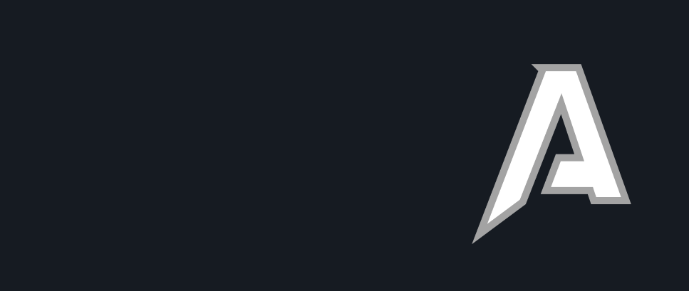

 
<h1> Hey! Nice to see you.</h1>

Welcome to my page!   I'm <b>Anupam</b>, Fullstack developer from Uttar pradesh,India. I am a final year student at <b>Birla institute of technology and Science Pilani</b>, pursuing <b>Electrical and Electronics Engineering</b>.

:mailbox: Reach me out!

 

- 🔭 I’m currently building crazy stuffs with @Schmooze
- :computer: Most used line of code `git commit -m "Random message"`
- 📫 How to reach me: anupam.fas27@gmail.com.
- 😄 Pronouns: Kenpachi.
- ⚡ Fun fact: I am a foodie and go to the GYM very often.

<h2>Things I code with:</h2>

               

 
 

## Feel free to contact me

- :paperclip: [My Resume/CV](https://drive.google.com/file/d/1n5Mpp3Yaf0ZkRUW3qz4sosBolr2yShqR/view?usp=sharing)
- :email: anupam.fas27@gmail.com
- :tv: [My Website](https://anupamsrivastava.me/)

<h3><b>Looking forward to hearing from you!</b></h3>

<!--
**meliodas113/meliodas113** is a ✨ _special_ ✨ repository because its `README.md` (this file) appears on your GitHub profile.

Here are some ideas to get you started:

- 🔭 I’m currently working on ...
- 🌱 I’m currently learning ...
- 👯 I’m looking to collaborate on ...
- 🤔 I’m looking for help with ...
- 💬 Ask me about ...
- 📫 How to reach me: ...
- 😄 Pronouns: ...
- ⚡ Fun fact: ...
-->
